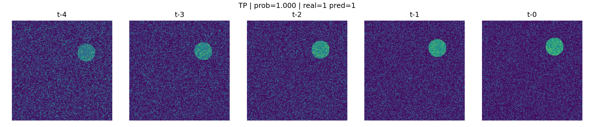
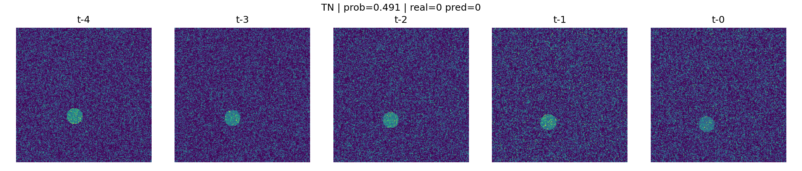
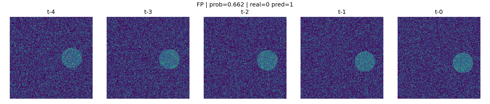
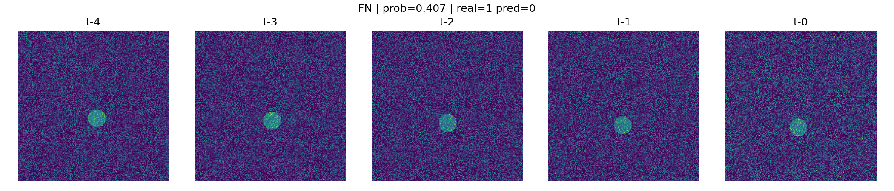

## Nowcasting (Previsão de curto prazo)

Modelo supervisionado que recebe 5 frames consecutivos de radar e prevê
se haverá célula convectiva intensa no próximo frame.

### Resultados (validação)

Confusion Matrix:

[[ 31  14]
 [  3 152]]

- Alta sensibilidade para eventos intensos (recall ~ 0.98)
- Alguns falsos positivos (modelo conservador)

### Exemplos

Veja em:
outputs/figures/future_examples/
- TP.png
- TN.png
- FP.png
- FN.png

## 🖼 Exemplos de Previsão (Nowcasting)

### True Positive (acerto evento intenso)

### True Negative (acerto ausência de evento)

### False Positive (alarme falso)

### False Negative (evento perdido)

